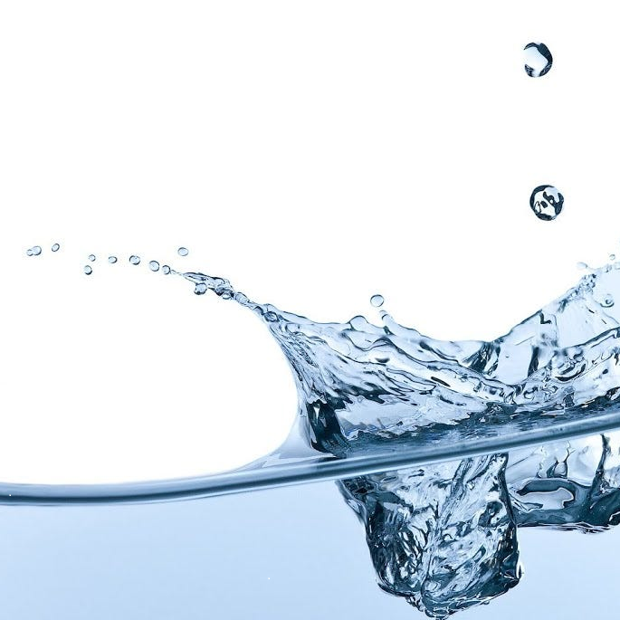

# fluid-sim-py


<p align="center">
  
</p>

`fluid-sim-py` is a standalone Python application for real-time visualization of fluid flow, based on [Stable Fluids](https://pages.cs.wisc.edu/~chaol/data/cs777/stam-stable_fluids.pdf).  

The simulation is designed for robustness with extensive in-line code documentation, making it easy to integrate new features. The underlying CFD solvers have been optimized with vectorization for efficient CPU usage (see [Benchmarks](#benchmarks) section).  

## Features

- Interactive fluid manipulation  
  - Move fluid: `left-click + drag`  
  - Add fluid sources: `left-click + s`  
  - Draw boundaries/obstacles: `right-click + drag`  

- GUI controls  
  - Adjust RGB color and width of boundaries  
  - Modify fluid source velocity  

- Screen recording  
  - Capture the simulation in real time  
  - Saved as `fluid_sim.mp4` for later viewing  

## Demo

<video controls src="https://github.com/Beniam-Kumela/fluid-sim-py/blob/main/img/fluid-sim-py-demo.mp4" title="demo"></video>

## Installation

Run the following terminal commands (Unix machines)

```
git clone https://github.com/Beniam-Kumela/fluid-sim-py.git
cd fluid-sim-py
python -m pip install --user virtualenv
python -m venv venv
source venv/bin/activate
pip install -r requirements.txt
python src/fluid-sim.py
```

If on Windows machine, instead of ```source venv/bin/activate``` run ```venv \Scripts\activate``` (see following [discussion](https://stackoverflow.com/questions/8921188/issue-with-virtualenv-cannot-activate))

## Benchmarks
| Architecture | Avg. FPS |
| - | - |
| M4 | 35 |
| i7 165U vPro |  |
|  |  |

All benchmarks were taken at Gauss-Seidel iterations = 16, grid dimension = 128x128, scaling factor = 5. Please update with this your personal machine performance.

## Contributing
Contributions are welcomed and appreciated! Fork and create a pull request on [GitHub](). We value the input and experiences all users and contributors bring to `fluid-sim-py`.

## Future
There are several features left to implement (feel free to extend this):
- Include hardware acceleration
  - `torch` tensor instead of `numpy` array operations
  - GPU-accelerated rendering
  - `numba` JIT

- Erase boundaries instead of returning to start menu